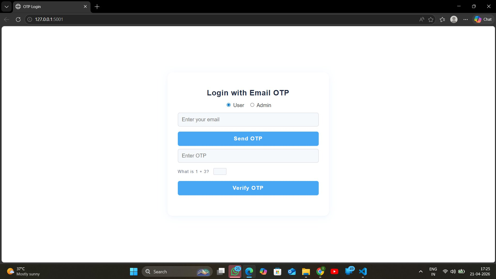
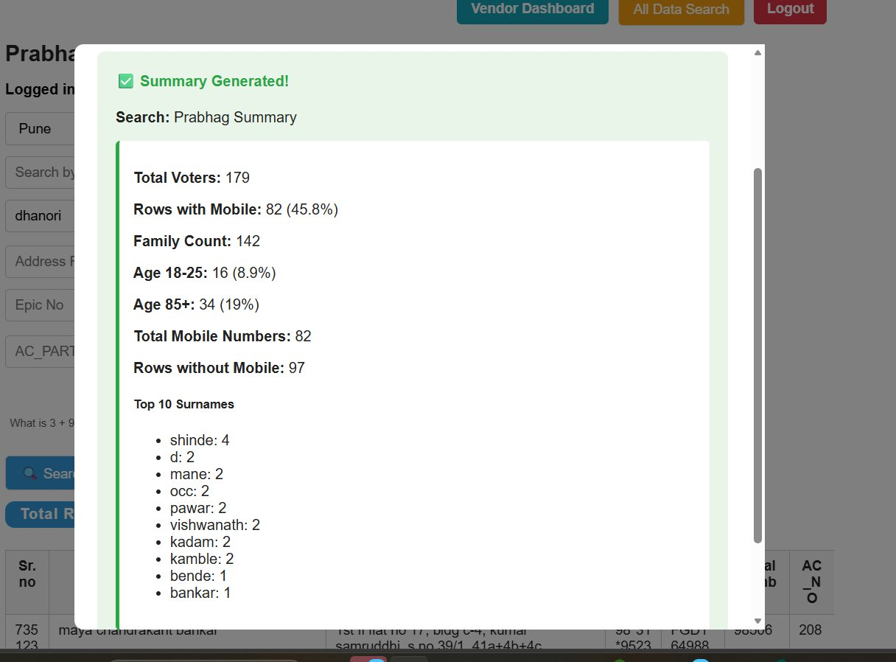
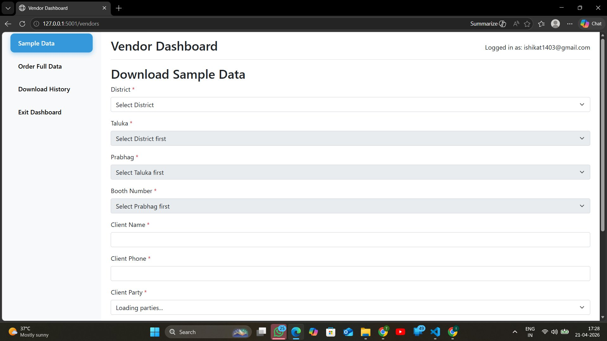
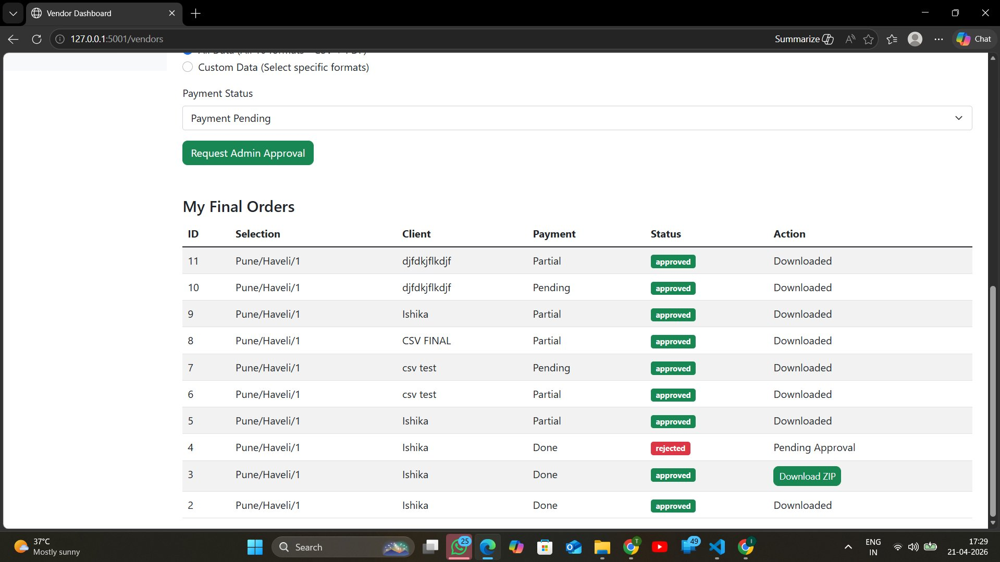

# Voter Data Platform — Engineering Overview

> **Note:** This repository contains architecture documentation only. The production codebase is confidential (internship project at Quickly Design Pvt. Ltd.). No source code is published here.

A high-scale voter data platform built during my internship to handle **25M+ records** with sub-second search, role-based access control, multilingual document generation, and concurrent API access at production load.

---

## The Problem

A civic technology platform needed to:
- Store and serve **25 million+ voter records** with fast filtered search
- Support **multi-role access** — admins, operators, field agents — each with different data visibility
- Generate **400,000+ personalized voter slip documents** (PNG + PDF) in multiple Indian languages
- Handle **concurrent access** from many users without query degradation
- Protect sensitive civic data with layered security (OTP, CAPTCHA, rate limiting, audit trails)

---

## System Architecture

```
┌─────────────────────────────────────────────────────────────────┐
│                        CLIENT LAYER                             │
│          React Frontend  ·  Admin Panel  ·  Field App           │
└────────────────────────┬────────────────────────────────────────┘
                         │ HTTPS
┌────────────────────────▼────────────────────────────────────────┐
│                      API GATEWAY (Flask)                        │
│   Rate Limiting · CAPTCHA Validation · JWT Verification         │
│   CSRF Protection · Request Logging · IP Filtering              │
└──────┬──────────────────┬──────────────────┬───────────────────┘
       │                  │                  │
┌──────▼──────┐  ┌────────▼───────┐  ┌──────▼──────────────────┐
│  Auth Layer │  │  Search & Data │  │    Export Pipeline       │
│             │  │  API Layer     │  │                          │
│ OTP Service │  │                │  │ Async Document Generator │
│ RBAC Engine │  │ Dynamic Filter │  │ PNG/PDF Renderer         │
│ Session Mgr │  │ Paginated APIs │  │ Multilingual Templates   │
└──────┬──────┘  └────────┬───────┘  └──────┬───────────────────┘
       │                  │                  │
┌──────▼──────┐  ┌────────▼───────┐  ┌──────▼────────┐
│    Redis    │  │  PostgreSQL    │  │  File Storage │
│             │  │                │  │               │
│ Sessions    │  │ 25M+ Records   │  │ Generated     │
│ Rate Limits │  │ Indexed Search │  │ Voter Slips   │
│ OTP Tokens  │  │ Audit Logs     │  │ CSV Exports   │
└─────────────┘  └────────────────┘  └───────────────┘
```

---

## Key Engineering Decisions

### 1. PostgreSQL over NoSQL for 25M Records

**Decision:** Use PostgreSQL with custom indexing rather than a document store (MongoDB/Elasticsearch).

**Reasoning:**
- Voter data has a **fixed schema** — relational model is a natural fit
- Complex **multi-field dynamic filters** (constituency + age + gender + name prefix) are significantly simpler to express and optimize in SQL vs NoSQL query builders
- PostgreSQL's **partial indexes** and **composite indexes** made targeted queries fast without full-table scans
- Connection pooling (via SQLAlchemy + PgBouncer pattern) handled concurrent access cleanly

**Result:** Sub-second filtered search across 25M rows with appropriate index design.

---

### 2. Dynamic SQL Filtering Architecture

**Challenge:** Users could filter on any combination of ~12 fields. Naive approaches (one query per filter combo, or massive WHERE clauses) would be unmaintainable and slow.

**Solution:** A **query builder pattern** that assembles parameterized SQL dynamically based on which filters are active, combined with a consistent pagination strategy.

```
incoming request filters
    │
    ▼
FilterBuilder.build(filters)  ──►  SELECT * FROM voters
    │                                WHERE ($1 IS NULL OR constituency = $1)
    │                                  AND ($2 IS NULL OR age >= $2)
    │                                  AND ($3 IS NULL OR name ILIKE $3)
    │                                LIMIT $N OFFSET $M
    ▼
Indexed PostgreSQL Query
```

Key insight: using `($n IS NULL OR column = $n)` patterns allows a **single parameterized query** to handle all filter combinations while still hitting indexes when values are provided.

---

### 3. Redis Session Design

**Decision:** Redis-backed sessions instead of database sessions.

**Why:**
- Database sessions create a **read on every authenticated request** — at scale this adds significant load
- Redis gives **O(1) session lookup** with built-in TTL expiry
- OTP tokens naturally fit Redis: short-lived, no joins needed, atomic operations for rate-limiting

**Session structure:**
```
session:{user_id}:{session_token}  →  { role, permissions, quota_remaining, expires_at }
TTL: 8 hours (configurable per role)

otp:{mobile}  →  { code, attempts, issued_at }
TTL: 5 minutes, max 3 attempts
```

---

### 4. Multilingual Export Pipeline

**Challenge:** Generate 400,000+ voter slips in regional Indian languages (Marathi, Hindi, English) as both PNG and PDF.

**Architecture:**
```
Export Request (CSV of voter IDs)
         │
         ▼
   Batch Processor
   (chunks of 500)
         │
         ├──► Template Engine (per language)
         │         │
         │         ▼
         │    Pillow / ReportLab
         │    (PNG / PDF render)
         │
         ▼
   Output Buffer → File Storage
         │
         ▼
   Progress Tracker (Redis)
         │
         ▼
   Download URL (served to user)
```

**Key decisions:**
- **Chunked batching** prevented memory spikes — 500 records/batch balanced throughput vs. memory
- **Font subsetting** for Indian scripts — only embed required Unicode ranges to keep PDF sizes manageable
- **Async generation** — large exports ran as background tasks; users polled a status endpoint

---

### 5. RBAC + Audit System

Role hierarchy with permission inheritance:

```
SuperAdmin
    └── Admin (district-level)
           └── Operator (booth-level)
                  └── Field Agent (read-only, quota-limited)
```

Each role had:
- **Data scope** — which constituency/district records they can access
- **Operation quota** — max searches per day (enforced via Redis counters)
- **Keyword access controls** — certain sensitive fields masked based on role
- **Audit log** — every data access recorded with timestamp, user, filters applied

---

## Key Outcomes

| Metric | Result |
|---|---|
| Records in system | 25M+ voter records |
| Documents generated | 400,000+ multilingual PNG/PDF slips |
| Query performance | Sub-second filtered search with indexing |
| Auth layers | OTP + JWT + RBAC + CAPTCHA + Rate limiting + CSRF |
| Deployment | AWS EC2 · Nginx · Gunicorn · Production uptime maintained |

---

## Tech Stack

| Component | Technology |
|---|---|
| Backend | Python / Flask |
| Database | PostgreSQL |
| Cache / Sessions | Redis (Redis Cloud) |
| Document Generation | Pillow (PNG), ReportLab (PDF) |
| Auth | OTP + JWT + Flask-Login |
| Deployment | AWS EC2, Nginx, Gunicorn, Ubuntu |

---

## What I Would Do Differently

- **Elasticsearch** for full-text name search — PostgreSQL ILIKE works but Elasticsearch handles fuzzy/transliteration matching better for Indian names
- **Celery + Redis** as a proper task queue for the export pipeline instead of a custom async approach
- **Read replicas** — at true scale, separating read traffic (search) from write traffic (audit logs) would improve latency further

---

*Built during Software Engineering Internship at Quickly Design Pvt. Ltd., Pune — Nov 2025 to Feb 2026.*

---

## Screenshots

> Screenshots taken from local development environment. The platform was deployed on AWS EC2 at `datafiltering.in` (election cycle complete, not currently live).

### OTP Login

*Email OTP auth with role selector (User / Admin) and math CAPTCHA*

### Prabhag Summary Analytics

*One-click analytics: total voters, mobile coverage %, family count, age distribution, top 10 surnames*

### Vendor Sample Download

*Hierarchical dropdowns: District → Taluka → Prabhag → Booth. Scoped to vendor's granted access only.*

### Vendor Order Management

*Full data order workflow: vendor places order → admin approves → one-time ZIP download*
